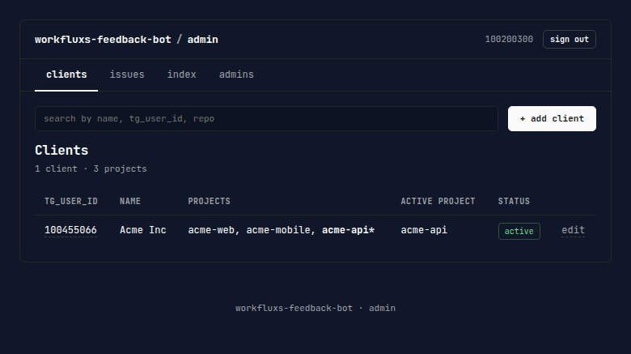
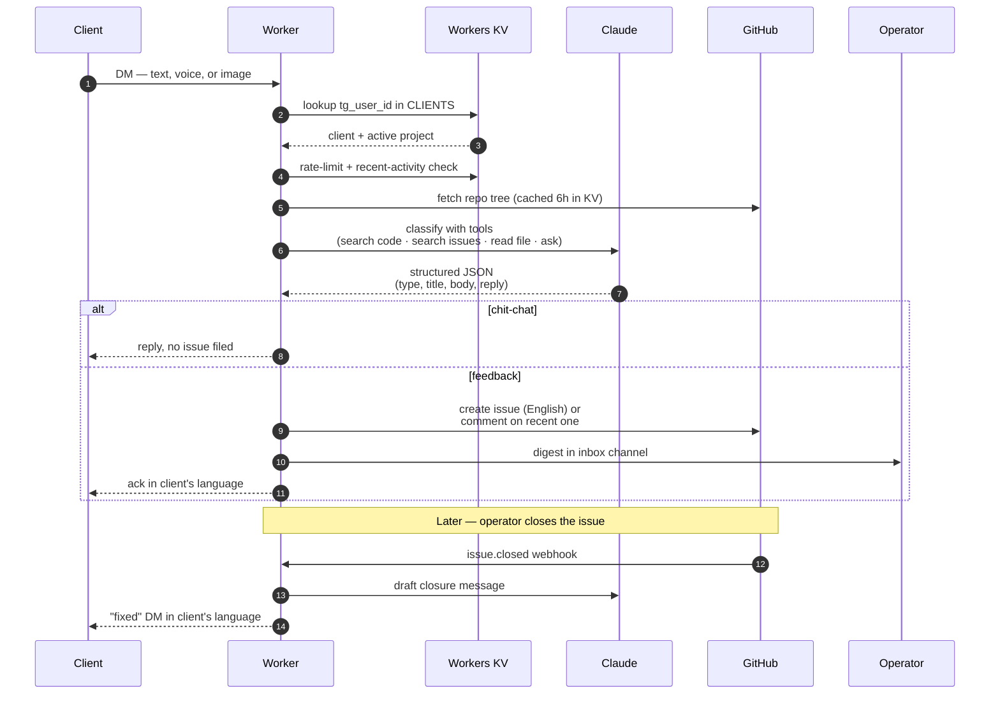

# issuary

A Cloudflare Worker that turns client Telegram messages into structured GitHub
Issues. Clients DM the bot in their own language; Claude classifies what they
said, files an issue in the right repo, acknowledges them in the same language,
and DMs them again when the issue is closed.

Built for small agencies & solo developers who maintain a few client projects
and don't want to teach those clients to use GitHub.



---

## What it does

- **One bot, many clients.** Each client DMs the same bot. The bot knows
  which client they are by `tg_user_id` and which of their projects to file
  against.
- **Multi-project per client.** A client with `web`, `mobile`, and `backend`
  can switch projects with `/use` or an inline keyboard. Single-project
  clients never see those commands.
- **Classifier, not a form.** A client writes `"the export button on the
  invoices page does nothing"` and the bot decides: is this a bug, a feature
  request, or chit-chat? If chit-chat, no issue is filed. If a bug, the issue
  title and body are written in English (so a downstream coding agent gets
  good input), labels are picked, and the GitHub repo's source tree is read
  for context before titling.
- **Voice & image support.** Voice notes are transcribed with Gemini.
  Screenshots are uploaded to GCS and linked from the issue.
- **Closure loop.** When you close the issue on GitHub, the client gets a
  short "fixed" DM in their language. They never had to learn that GitHub
  exists.
- **Admin dashboard.** `/admin` is a small web UI for the operator —
  clients, projects, recent issues, admins, and per-repo semantic
  code-index status (`/admin/index-status`: state, chunk counts, freshness,
  a force-`rebuild` button, and a Workers AI neuron / KV-ops usage panel).
  Magic-link auth via the bot's Telegram DM (no passwords, no OAuth
  provider).

## Stack

- **Runtime:** Cloudflare Workers (`nodejs_compat`)
- **State:** Workers KV (12 namespaces, all in `wrangler.toml.example`)
- **Classifier:** Claude Opus 4.8 via the Anthropic SDK, with tool use
  (search code, search issues, read file, ask clarifying question)
- **Code retrieval:** per-repo semantic index in Cloudflare Vectorize +
  Workers AI embeddings, kept fresh by push webhooks against a blob-SHA baseline
- **Auth:** GitHub App with installation tokens (one App, all your repos)
- **Media:** Google Cloud Storage + Gemini for voice
- **Tracing:** LangSmith (optional)
- **Tests:** vitest-pool-workers with real Miniflare KV — 508 tests, no mocks
  of KV or HTTP transport

---

## Deploy your own

You need: a Cloudflare account, a Telegram bot from
[@BotFather](https://t.me/BotFather), an Anthropic API key, a GitHub App
(free), and a Google Cloud project for media + voice transcription.

**1. Clone and install**

```bash
git clone https://github.com/idoZ-H/issuary
cd issuary
npm install
```

**2. Configure**

```bash
cp .env.example .env
cp wrangler.toml.example wrangler.toml
# Edit both. .env holds local CLI helpers. wrangler.toml gets KV ids in step 3.
```

**3. Create the 12 KV namespaces**

```bash
for ns in CLIENTS ADMINS REPO_CONTEXT RECENT_ACTIVITY \
          PENDING_CLASSIFICATION CONVERSATION_HISTORY RATE_LIMITS \
          ISSUE_TO_CHAT DEDUP ADMIN_SESSIONS ISSUE_LIST_CACHE \
          CODE_INDEX_META; do
  npx wrangler kv namespace create "$ns"
done
```

Paste each printed `id` into the matching binding in `wrangler.toml`.

**4. Upload secrets**

`.env` holds your local copies; the Worker reads them via `wrangler secret put`:

```bash
for k in TELEGRAM_BOT_TOKEN TELEGRAM_WEBHOOK_SECRET GITHUB_WEBHOOK_SECRET \
         ANTHROPIC_API_KEY GEMINI_API_KEY GCS_SERVICE_ACCOUNT_JSON \
         GCS_BUCKET GITHUB_APP_ID GITHUB_APP_PRIVATE_KEY \
         IDO_TG_USER_ID IDO_INBOX_CHAT_ID; do
  grep "^$k=" .env | cut -d= -f2- | npx wrangler secret put "$k"
done
```

**5. Deploy**

```bash
npx wrangler deploy
```

Capture the printed Worker URL.

**6. Wire up Telegram and GitHub**

Register the Telegram webhook (only takes one curl — see
[DEPLOY.md](DEPLOY.md) for the exact command) and install your GitHub App
on every repo you want the bot to file against.

**7. Sign in to `/admin`**

DM the bot any message so the Worker logs your `tg_user_id`. Then:

```bash
npx wrangler kv key put --binding=ADMINS "<YOUR_TG_USER_ID>" '{"role":"admin"}' --remote
```

Visit `https://<your-worker>.workers.dev/admin`, enter your `tg_user_id`,
click the magic link from your Telegram DM. Add clients & projects from the
UI.

Full step-by-step (with GitHub App creation, secret rotation, gotchas) is in
[DEPLOY.md](DEPLOY.md). Day-to-day operations are in
[docs/operations.md](docs/operations.md).

---

## Local development

```bash
npm run dev         # wrangler dev on localhost:8787
npm test            # vitest, 508 tests, real Miniflare KV
npm run typecheck   # tsc --noEmit
```

For end-to-end manual testing, point a second Telegram bot's webhook at an
`ngrok` tunnel to your local `wrangler dev`. The classifier uses your live
Anthropic key in dev too.

## Architecture



The numbered steps in plain prose, with the implementation hooks:

1. **Telegram webhook hits `/telegram/webhook`.** Worker verifies the
   `X-Telegram-Bot-Api-Secret-Token` header against `TELEGRAM_WEBHOOK_SECRET`.
2. **Identity** — `tg_user_id` looked up in `CLIENTS` KV. Unknown senders
   get a polite rejection in their language; admins bypass identity gates.
3. **Rate limit** — 30 messages/hour per client, $2/day Claude cost
   ceiling. Over → polite reply + operator alert.
4. **Recency aggregator** — if the same client already has an in-flight
   issue on this project from the last 60s, this message becomes a comment
   on it instead of a new issue. (`RECENT_ACTIVITY` KV.)
5. **Repo context** — repo file tree pulled from
   `/repos/.../git/trees/<branch>?recursive=1`, cached 6h in `REPO_CONTEXT`
   KV. The directory listing is included in the classifier prompt so it
   has real grounding.
6. **Classifier** — Claude Opus 4.8 with tool use:
   `github_search_code`, `github_search_issues`, `github_read_file`,
   `ask_clarifying_question`. `github_search_code` returns GitHub's
   text-search hits *and* `semantic_matches` — file/line ranges from the
   per-repo Vectorize index, which stay reliable even when GitHub's
   private-repo search index is empty. Cache breakpoint sits after the
   stable preamble + repo context, so cache hits stay high (~8K of 14K
   input tokens read from cache in practice).
7. **Issue writer** — creates a new issue or comments on the recent one.
   Title and body are written in **English** because issues downstream
   feed coding agents; the client's reply is in their language.
8. **Closure** — when the issue is closed on GitHub, the App webhook fires
   `/github/webhook`. Worker looks up the originating chat in
   `ISSUE_TO_CHAT` KV, asks Claude to draft a short "fixed" message, and
   DMs the client.

### Semantic code index — the blob-SHA baseline

The `semantic_matches` in step 6 come from a per-repo Vectorize index whose
cost is designed to scale with **code churn, not repo size or a clock**. The
manifest stores a **baseline**: every indexed file's git blob SHA (a content
hash). Three layers keep the index fresh against that baseline:

- **Push-driven (primary).** The same App `/github/webhook` also handles
  `push`. For each semantic-enabled project on the pushed default branch, the
  Worker re-embeds the `added ∪ modified` files and deletes vectors for
  `removed` ones — visible in seconds, ~5–50 neurons per push.
- **Baseline diff (safety net).** A 6h cron (`CODE_INDEX_TTL_S`) refetches the
  repo tree and diffs its blob SHAs against the stored baseline, re-embedding
  only changed/new paths and deleting removed ones. An unchanged repo costs one
  tree call and **zero** neurons. This self-heals any push that was missed or
  truncated (GitHub caps `commits[]` at 20) and removes orphaned vectors.
- **Full rebuild (manual).** A from-scratch re-embed runs only on the admin
  `rebuild` button or a chunker-version bump — never automatically.

The push event must be subscribed on the GitHub App (App ID `<your-app-id>`); without
it, pushes silently never arrive and only the 6h diff keeps the index current.

## What's in `/admin`

| Route | What it does |
|---|---|
| `/admin/login` | Telegram-DM magic link, 10-min single-use token, 30-day session cookie |
| `/admin/clients` | List, add, edit, delete clients; toggle shadow mode |
| `/admin/clients/:id` | Manage projects (add, set active, set default, change repo, toggle semantic code search, view per-project index state, remove) |
| `/admin/issues` | 50 most recent issues across all projects, 90-day window, filter by client |
| `/admin/index-status` | Per-repo semantic code-index status (state, chunks, chunker version, age), plus a force-`rebuild` button and a Workers AI neuron / KV-ops usage panel. Indexes update incrementally on every push and self-heal via a 6h blob-SHA baseline diff; full rebuilds are manual-only. |
| `/admin/admins` | Add/remove admins. You can't remove yourself. |

The dashboard mirrors the `/admin <verb>` Telegram commands the bot still
supports — pick whichever surface you prefer.

---

## Tests

```bash
npm test
```

508 tests. They run against real Miniflare KV (not mocks) via
`@cloudflare/vitest-pool-workers`, so behavior matches production within
the workerd runtime.

`tests/stubs/langsmith*.ts` exist because `langsmith` transitively imports
`node:fs/promises` which workerd's test build can't resolve even with
`nodejs_compat`. Production Workers load langsmith fine; the stubs are
test-only.

## License

[MIT](LICENSE).

## Contributing

PRs welcome. Run `npm test` and `npm run typecheck` before opening one. The
code is organized into:

- `src/handlers/` — webhook entry points (telegram, github, admin-ui)
- `src/pipeline/` — the classifier
- `src/lib/` — KV, Telegram client, GitHub client, GCS, AI wrapper
- `src/admin/` — the `/admin` web UI (server-rendered HTML, no JS bundle)
- `src/prompts/` — classifier prompt (Hebrew-aware, tuned for Opus 4.8)

If you're forking this for a different language pair, the prompt in
`src/prompts/classifier.ts` is the main thing you'll want to rewrite.

## Credits

- The `/admin` aesthetic is borrowed from
  [turbopuffer.com](https://turbopuffer.com) — bordered cards, JetBrains
  Mono, restrained color palette.
- Dashboard is server-rendered HTML with a `html` tagged template + escape
  helper — no bundler, no client JS. Inspired by
  [htmx](https://htmx.org)'s "the browser already does this" mindset.
- Issue triage UX was modeled on what an attentive maintainer would do by
  hand: read the repo before titling, prefer commenting on a recent open
  issue over filing a duplicate, write the issue in the language the
  *engineer* will read it in.
